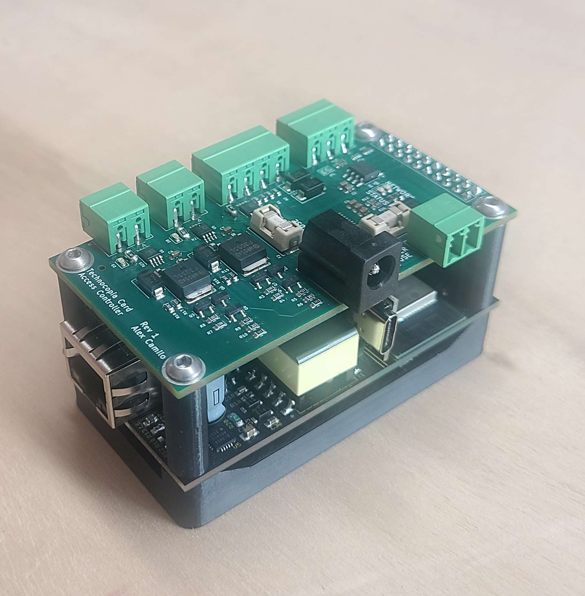

# device-mounting-hardware
Mechanical designs for mounting electronic control boards, readers, and supporting components in access control or embedded systems deployments.

plate.stl prints with supports and takes a 32mm x 5mm magnet, glued in

